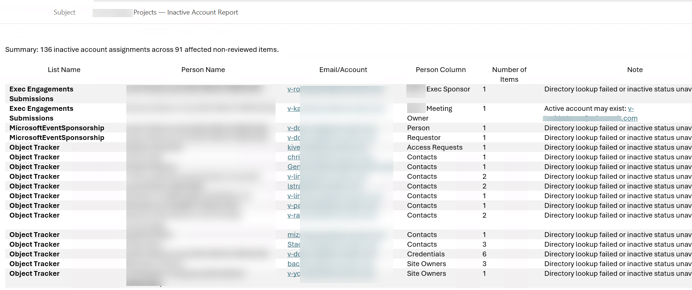

# Inactive-Account-Audit

The **Inactive-Account-Audit** skill scans all lists within a SharePoint site to identify inactive user accounts stored in custom People fields. It is designed to support governance, cleanup, and workflow reliability by highlighting items assigned to accounts that are no longer active in the organization.

## Overview

Inactive accounts in list items can lead to stalled workflows, unclear ownership, and data quality issues. This skill provides a structured way to detect and review these accounts across the entire site.

## How It Works

- Scans every list in the SharePoint site.
- Identifies custom People fields that contain user accounts.
- Checks each referenced account to determine whether it is inactive.
- Returns a structured report of all items containing inactive accounts.

## Fields Excluded from Scanning

The skill intentionally avoids system-managed fields, including:

- Created By
- Modified By
- Other built-in metadata fields automatically maintained by SharePoint

These fields often contain historical or service accounts and are not relevant to operational ownership or workflow continuity.

## Output

The skill produces a structured summary email that includes:

- Lists scanned
- Person Name
- Custom People fields inspected
- Items containing inactive accounts
- Details about each inactive account detected

</img>

## Use Cases

- Governance and compliance audits
- Pre-migration cleanup
- Workflow reliability checks
- Quarterly or scheduled maintenance
- Automated lifecycle management
